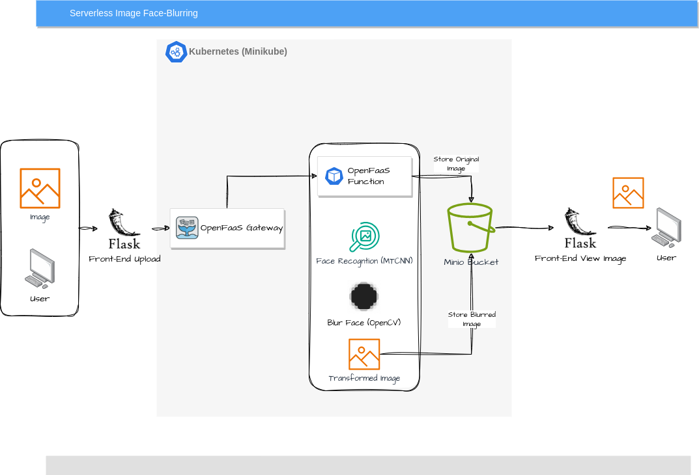

# Serverless Image Face Blurring

The project aims to build a serverless application that blurs faces on an image. Was initially done for school project (HKUST COMP4651) but will work on it more.

It uses [OpenFaaS](https://www.openfaas.com/) for serverless function (Lambda), [Minio](https://min.io/) for original and blurred image storage (S3), and [Minikube](https://minikube.sigs.k8s.io/docs/) with Docker for deployment (EKS). The serverless function uses Python with [MTCNN](https://github.com/ipazc/mtcnn) for face recognition (Rekognition) and [OpenCV](https://pypi.org/project/opencv-python-headless/) for blurring. It then stores the images to a bucket using Minio Python SDK. Front-end website uses Flask.

## Demo


## Architecture



## Setup

### Libraries/Tools

#### Required

- docker
- minikube
- helm
  - openfaas
  - minio object
- kubectl
- faas-cli

#### Optional

- MinIO Client
- Python, Pip, Flask, MinIO Python SDK

### Instructions

Install Docker, Minikube, Helm, KubeCtl, and OpenFaaS CLI. 

Then install OpenFaaS for Minikube with Helm (see instructions [here](https://faun.pub/getting-started-with-openfaas-on-minikube-634502c7acdf)). Optionally install MinIO client.

Next install MinIO for Kubernetes with `kubectl` by running `kubectl apply -f minio-dev.yaml`. After a few seconds run `kubectl get pods -n minio-dev -o wide | awk 'NR>1 {print $6}' > face-blur/function/minio_ip.txt` to export MinIO container IP address so that OpenFaaS can communicate with it.

Forward both OpenFaaS and MinIO ports for access using `kubectl port-forward -n openfaas svc/gateway 8080:8080 && kubectl port-forward svc/minio -n minio-dev 9090 9000`. Use `localhost:8080` for web UI for OpenFaaS and `localhost:9090` for web ui for MinIO (the API is port 9000).

Run `faas-cli build -f ./face-blur.yml && faas-cli deploy -f ./face-blur.yml` to build and deploy the function.

### Running Demo

To use the front-end interface, there is a Flask app in `front-end` folder.

Either just `pip install flask minio requests` then run `python app.py` in `front-end` folder, or use instructions below for virtual environment:

``` bash
# create virtual environment
python -m venv venv

# activate it
source venv/bin/activate


pip install -r requirements.txt

python app.py
```

Then go to `localhost:5000` for the web UI. Upload an image using the buttons. If successful, both original and blurred image should be in the bucket that you can check with MinIO client or MinIO web console.

## Deadline

[](https://classroom.github.com/a/B_Lemfbx)
